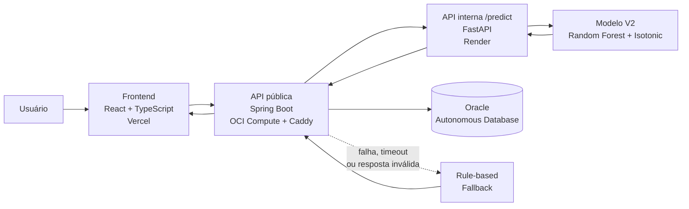

# ⚡ EnergiAI — Inteligência para Consumo Energético

### 🎓 Hackathon ONE G9-BR | Alura + Oracle | NoCountry

[](https://github.com/No-Country-simulation/g9-br-team-09/releases/tag/v1.0.0)
[](https://github.com/No-Country-simulation/g9-br-team-09)
[](backend/)
[](backend/)
[](data-science/)
[](data-science/)
[](frontend/)
[](frontend/)
[](docs/oracle-autonomous-database.md)

[](https://github.com/No-Country-simulation/g9-br-team-09/actions/workflows/backend-ci.yml)
[](https://github.com/No-Country-simulation/g9-br-team-09/actions/workflows/frontend-ci.yml)
[](https://github.com/No-Country-simulation/g9-br-team-09/actions/workflows/data-science-ci.yml)

> **MVP full stack de análise energética** que transforma cinco informações simples de consumo em uma classificação de eficiência, índice de ineficiência, probabilidade, custo mensal estimado e recomendações contextualizadas — combinando Machine Learning, fallback resiliente, autenticação e persistência em Oracle Cloud.

### 🔗 Acessos rápidos

- 🌐 **Aplicação:** [energiai.vercel.app](https://energiai.vercel.app)
- 📘 **Swagger UI:** [API pública do EnergiAI](https://147.15.30.0.sslip.io/api/v1/swagger-ui/index.html)
- 📄 **OpenAPI:** [Contrato publicado](https://147.15.30.0.sslip.io/api/v1/v3/api-docs)
- ❤️ **Health:** [Status do backend](https://147.15.30.0.sslip.io/api/v1/actuator/health)
- 📦 **Release estável:** [EnergiAI v1.0.0](https://github.com/No-Country-simulation/g9-br-team-09/releases/tag/v1.0.0)

> O hostname público da API utiliza `sslip.io` sobre o IP efêmero da instância OCI. Caso o IP da instância seja alterado, os links públicos precisam ser atualizados.

---

## 📑 Sumário

- [Sobre o projeto](#-sobre-o-projeto)
- [O problema](#%EF%B8%8F-o-problema)
- [A solução](#-a-solução)
- [Principais funcionalidades](#-principais-funcionalidades)
- [Arquitetura](#%EF%B8%8F-arquitetura)
- [Dados de entrada e resultado](#-dados-de-entrada-e-resultado)
- [Machine Learning](#-machine-learning)
- [Resultados da modelagem](#-resultados-da-modelagem)
- [Resiliência e fallback](#-resiliência-e-fallback)
- [Tecnologias utilizadas](#-tecnologias-utilizadas)
- [Qualidade e validação](#-qualidade-e-validação)
- [Estrutura do repositório](#-estrutura-do-repositório)
- [Como executar localmente](#-como-executar-localmente)
- [Documentação técnica](#-documentação-técnica)
- [Limitações do MVP](#%EF%B8%8F-limitações-do-mvp)
- [Equipe](#-equipe)

---

## 🎯 Sobre o projeto

O **EnergiAI** foi desenvolvido pela **G9-BR-Team 09** no Hackathon ONE G9-BR, dentro do ecossistema **Oracle Next Education (ONE), Alura e NoCountry**.

O projeto parte de uma pergunta simples:

> **Como transformar dados básicos de consumo elétrico em uma análise clara, acionável e tecnicamente rastreável?**

A solução integra **frontend, backend, Machine Learning e Oracle Cloud** em um fluxo completo. O usuário informa características do seu consumo, recebe uma análise energética e pode consultar seu histórico e indicadores em uma aplicação web autenticada.

A versão **v1.0.0** representa o snapshot estável da entrega final do MVP.

---

## ⚠️ O problema

Contas de energia mostram consumo e custo, mas geralmente não explicam de forma simples **como hábitos, horários de pico, quantidade de equipamentos e perfil do imóvel se combinam**.

Para residências e pequenos estabelecimentos, isso dificulta:

- compreender o próprio padrão de consumo;
- identificar situações de maior ineficiência;
- transformar dados em ações práticas;
- acompanhar análises anteriores;
- visualizar indicadores de forma consolidada.

O EnergiAI foi criado para reduzir essa distância entre **dado bruto** e **decisão de consumo**.

---

## 💡 A solução

O usuário preenche cinco informações sobre seu perfil energético. O sistema:

1. autentica e identifica o usuário;
2. valida os dados informados;
3. envia as cinco features para a API interna de Machine Learning;
4. executa a inferência com o modelo energético V2;
5. valida a resposta do modelo no backend;
6. calcula o custo mensal de referência;
7. persiste a análise no Oracle Autonomous Database;
8. devolve o resultado para a interface;
9. disponibiliza histórico, detalhes e dashboard do próprio usuário.

Se a FastAPI estiver indisponível, exceder o timeout ou devolver uma resposta inválida, o backend utiliza um **fallback determinístico baseado em regras**, preservando a disponibilidade da análise.

---

## ✨ Principais funcionalidades

| Funcionalidade | Entrega |
|---|---|
| 🔐 **Cadastro e autenticação** | Login, JWT, renovação de sessão e logout |
| ⚡ **Nova análise energética** | Formulário com as cinco entradas oficiais |
| 🤖 **Machine Learning** | Inferência com o modelo energético V2 |
| 📊 **Classificação** | `EFICIENTE`, `MODERADO` ou `INEFICIENTE` |
| 🎯 **Índice de ineficiência** | Score de severidade entre `0` e `100` |
| 📈 **Probabilidade** | Probabilidade associada à categoria prevista pelo modelo |
| 💰 **Custo estimado** | `consumo_kwh × R$ 0,75` |
| 💡 **Recomendações** | Recomendações energéticas contextualizadas |
| 🧯 **Fallback resiliente** | Continuidade via `RULE_BASED_FALLBACK` |
| 🗂️ **Histórico** | Listagem paginada das análises do usuário |
| 🔎 **Detalhamento** | Consulta individual de análise persistida |
| 📉 **Dashboard** | Indicadores consolidados das análises do usuário |
| ☁️ **Cloud** | Backend em OCI, banco Oracle e FastAPI publicada |
| 📚 **API documentada** | Swagger/OpenAPI e documentação técnica versionada |

---

## 🏗️ Arquitetura



### Responsabilidades por camada

| Camada | Responsabilidade |
|---|---|
| **Frontend** | Interface, autenticação do usuário, formulário, resultado, histórico, detalhe e dashboard |
| **Spring Boot** | API pública, autenticação, validação, orquestração, cálculo de custo, persistência e fallback |
| **FastAPI** | Inferência, categoria, probabilidade, score, recomendações e versão do modelo |
| **Modelo V2** | Classificação probabilística com pipeline congelado |
| **Oracle Autonomous Database** | Persistência de usuários, sessões e análises |
| **OCI Compute + Caddy** | Execução do backend e exposição HTTPS da API pública |
| **Vercel** | Hospedagem do frontend |
| **Render** | Hospedagem da FastAPI interna |

> O frontend **não acessa `/predict` diretamente**. O Spring Boot é a única fronteira pública da análise energética e permanece responsável por custo, persistência e fallback.

---

## 🧾 Dados de entrada e resultado

### Cinco entradas oficiais

| Campo | Tipo | Exemplo | Descrição |
|---|---|---:|---|
| `consumo_kwh` | número | `420` | Consumo mensal informado |
| `uso_horario_pico` | booleano | `true` | Indica uso relevante em horário de pico |
| `quantidade_equipamentos` | inteiro | `10` | Quantidade de equipamentos |
| `tipo_imovel` | enum | `CASA` | Tipo do imóvel |
| `horas_alto_consumo` | inteiro | `8` | Horas de alto consumo |

Tipos de imóvel suportados:

`CASA` · `APARTAMENTO` · `COMERCIO` · `ESCRITORIO` · `INDUSTRIA` · `OUTRO`

### Exemplo de request

```json
{
  "consumo_kwh": 420,
  "uso_horario_pico": true,
  "quantidade_equipamentos": 10,
  "tipo_imovel": "CASA",
  "horas_alto_consumo": 8
}
```

### Resultado público

A resposta da API pública contém:

- identificador da análise;
- categoria energética;
- probabilidade;
- índice de ineficiência;
- custo mensal estimado;
- recomendações;
- fonte da classificação.

Exemplo de estrutura:

```json
{
  "id": 1,
  "categoria": "INEFICIENTE",
  "probabilidade": 0.75,
  "score": 95,
  "custo_estimado_mensal": 315.00,
  "recomendacoes": [
    "Reduzir o uso de equipamentos durante horários de pico."
  ],
  "fonte_classificacao": "RULE_BASED_FALLBACK"
}
```

> Os valores acima são apenas um exemplo de contrato. A resposta efetiva depende dos dados enviados e da fonte de classificação utilizada.

---

## 🤖 Machine Learning

A solução oficial de Machine Learning foi desenvolvida sobre um **dataset sintético V2 com 5.000 registros**, seed `42`, cinco features de produção e seis tipos de imóvel.

### Modelos avaliados

Foram comparados cinco algoritmos definidos para o projeto, utilizando somente treino e validação durante a seleção:

| Modelo | CV F1-macro médio | F1-macro validação |
|---|---:|---:|
| Dummy Classifier | 0,188818 | 0,189112 |
| Regressão Logística | 0,930248 | 0,937864 |
| Árvore de Decisão | 0,861918 | 0,836870 |
| Random Forest | 0,951890 | 0,952086 |
| HistGradientBoosting | 0,953864 | 0,952011 |

Os dois finalistas foram:

- **Random Forest**
- **HistGradientBoosting**

Somente esses dois modelos receberam busca controlada de hiperparâmetros.

### Pipeline final

A solução congelada utiliza:

```text
Random Forest
+ calibração isotônica
+ Pipeline
+ ColumnTransformer
+ StandardScaler
+ OneHotEncoder(handle_unknown="ignore")
```

Configuração principal do Random Forest:

```text
n_estimators = 200
max_features = "sqrt"
min_samples_leaf = 1
random_state = 42
n_jobs = 1
```

### Protocolo metodológico

A modelagem foi conduzida com isolamento explícito entre treino, validação e teste:

```text
Dataset V2
   │
   ├── 70% treino       → 3.500 registros
   ├── 15% validação    →   750 registros
   └── 15% holdout      →   750 registros
```

O processo adotado foi:

1. auditar o dataset;
2. manter EDA decisória somente no treino;
3. comparar os cinco modelos em treino e validação;
4. selecionar os dois melhores por F1-macro;
5. ajustar somente os dois finalistas;
6. comparar probabilidades `raw`, `sigmoid` e `isotonic`;
7. congelar pré-processamento, modelo, hiperparâmetros, calibração e regras de inferência;
8. validar formalmente o congelamento;
9. acessar o holdout para avaliação oficial **uma única vez**;
10. serializar e testar o artefato final.

Nenhum resultado do holdout foi utilizado para selecionar modelo, hiperparâmetros, features ou calibração.

---

## 📈 Resultados da modelagem

### Avaliação oficial do holdout sintético

| Métrica | Resultado |
|---|---:|
| **F1-macro** | `0,9612` |
| **Log Loss** | `0,1253` |
| **Brier multiclasses** | `0,0527` |
| **Registros no holdout** | `750` |
| **Avaliações oficiais do holdout** | `1` |

O artefato final é versionado em:

```text
data-science/models/modelo_energetico_v2.joblib
```

A versão do modelo é:

```text
energy-classifier-v2
```

> **O resultado mede a capacidade do modelo de reproduzir padrões da base sintética sob as condições testadas.**

Essas métricas **não comprovam desempenho em dados reais, causalidade, economia real ou validade externa**.

---

## 🧯 Resiliência e fallback

O EnergiAI adota uma estratégia **ML-first**.

### Fluxo normal

```text
Spring Boot
→ FastAPI
→ modelo V2
→ resposta validada
→ fonte_classificacao = ML_MODEL
```

### Fluxo de contingência

Se houver:

- indisponibilidade da FastAPI;
- timeout;
- erro HTTP;
- falha de transporte;
- resposta ausente;
- payload semanticamente inválido;

o backend utiliza:

```text
RULE_BASED_FALLBACK
```

O fallback pertence ao **Spring Boot**. A FastAPI não calcula custo, não persiste dados e não implementa a contingência do backend.

Essa separação mantém o sistema funcional mesmo quando o serviço de Machine Learning não está disponível.

---

## 🧰 Tecnologias utilizadas

| Área | Tecnologia | Uso |
|---|---|---|
| **Frontend** | React 19 | Interface web |
| **Frontend** | TypeScript 6 | Tipagem |
| **Frontend** | Vite 8 | Build e desenvolvimento |
| **Frontend** | Tailwind CSS | Estilização |
| **Frontend** | React Router | Roteamento |
| **Frontend** | Axios | Cliente HTTP |
| **Frontend** | Zod | Validação de dados |
| **Frontend** | Recharts | Visualizações do dashboard |
| **Backend** | Java 21 | Linguagem principal |
| **Backend** | Spring Boot 4.0.7 | API e orquestração |
| **Backend** | Spring Security | Autenticação e autorização |
| **Backend** | Spring Data JPA | Persistência |
| **Backend** | Flyway | Versionamento do schema |
| **Backend** | Springdoc OpenAPI | Swagger/OpenAPI |
| **Data Science** | Python 3.12 | Modelagem e inferência |
| **Data Science** | FastAPI 0.140.0 | API interna de inferência |
| **Data Science** | scikit-learn 1.9.0 | Machine Learning |
| **Data Science** | pandas / NumPy | Processamento de dados |
| **Banco** | Oracle Autonomous Database | Persistência em cloud |
| **Banco local** | H2 | Desenvolvimento e testes |
| **Infraestrutura** | OCI Compute | Backend em produção |
| **Proxy / HTTPS** | Caddy | Proxy reverso e TLS |
| **Frontend Cloud** | Vercel | Deploy da SPA |
| **ML Cloud** | Render | Deploy da FastAPI |
| **Containers** | Docker / Compose | Empacotamento e operação |
| **IaC** | Terraform | Infraestrutura OCI |
| **Testes** | JUnit / Mockito | Backend |
| **Testes** | Pytest | Data Science e FastAPI |
| **Testes** | Vitest / Testing Library | Frontend |
| **E2E** | Playwright | Fluxos ponta a ponta |
| **CI** | GitHub Actions | Validação automatizada |

---

## ✅ Qualidade e validação

A release `v1.0.0` foi promovida após validações automatizadas das principais áreas.

### Snapshot registrado na release

| Área | Evidência |
|---|---|
| **Backend** | `266` testes aprovados |
| **Frontend** | `53` testes Vitest aprovados |
| **Data Science** | `467` testes coletados com suíte validada |
| **Frontend** | lint e build aprovados |
| **Backend Docker** | validação automatizada aprovada |
| **OpenAPI** | contrato validado por testes |
| **E2E** | suíte Playwright integrada |
| **CI** | workflows de backend, frontend e Data Science |

A estratégia de qualidade inclui:

- testes unitários;
- testes de integração;
- testes de contrato;
- validação de schema;
- testes negativos e de erros;
- smoke tests;
- CI por área;
- validação Docker;
- testes E2E;
- rastreabilidade por artefatos, hashes e documentação.

---

## 📁 Estrutura do repositório

```text
g9-br-team-09/
│
├── backend/                     # API pública Spring Boot
│   ├── src/
│   ├── Dockerfile
│   └── README.md
│
├── data-science/                # Dataset, modelagem e FastAPI
│   ├── app/                     # API interna de inferência
│   ├── data/                    # Dataset sintético V2
│   ├── docs/                    # Especificações e relatório de modelagem
│   ├── examples/                # Exemplos reproduzíveis
│   ├── models/                  # Artefato final e metadados
│   ├── notebooks/               # Notebooks
│   ├── src/                     # Lógica testável de Data Science
│   └── tests/                   # Testes Python
│
├── frontend/                    # SPA React + TypeScript
│   ├── src/
│   ├── e2e/
│   └── README.md
│
├── infra/                       # Terraform, deploy OCI e smoke tests
│
├── docs/                        # Contratos, arquitetura e entrega
│
├── .github/workflows/           # CI, segurança e automações
│
└── README.md
```

---

## 🚀 Como executar localmente

### Pré-requisitos

- **Java 21**
- **Node.js 20.19+**
- **Python 3.12**
- Git
- npm
- Maven Wrapper já incluído
- Docker apenas para os fluxos que utilizam containers

### 1. Clone o repositório

```bash
git clone https://github.com/No-Country-simulation/g9-br-team-09.git
cd g9-br-team-09
```

### 2. FastAPI / modelo

```bash
cd data-science

python -m venv .venv
source .venv/bin/activate

python -m pip install --upgrade pip
python -m pip install -r requirements-api.txt

cp .env.api.example .env.api
python -m uvicorn app.main:app --host 0.0.0.0 --port 8000
```

O exemplo de configuração utiliza:

```dotenv
MODEL_PATH=./models/modelo_energetico_v2.joblib
MODEL_VERSION=energy-classifier-v2
```

Health local:

```text
http://localhost:8000/health
```

### 3. Backend Spring Boot

Em outro terminal:

```bash
cd backend

export JWT_SECRET="$(openssl rand -base64 32)"
SPRING_PROFILES_ACTIVE=local ./mvnw spring-boot:run
```

API local:

```text
http://localhost:8080/api/v1
```

Swagger:

```text
http://localhost:8080/api/v1/swagger-ui/index.html
```

### 4. Frontend

Em outro terminal:

```bash
cd frontend

npm install
cp .env.example .env
npm run dev
```

Configure no `.env`:

```dotenv
VITE_API_BASE_URL=http://localhost:8080/api/v1
```

> Para Windows PowerShell, execução OCI, Docker e configurações completas, consulte os READMEs específicos de cada módulo.

---

## 📚 Documentação técnica

| Documento | Conteúdo |
|---|---|
| [Documentação final de entrega](docs/delivery/README.md) | Visão consolidada do MVP e Demo Day |
| [Contrato HTTP](docs/api-contract.md) | Fonte normativa da API pública e FastAPI interna |
| [Status do projeto](docs/project-status.md) | Estado técnico consolidado |
| [Decisões arquiteturais](docs/architecture-decisions.md) | ADRs e decisões transversais |
| [Backend](backend/README.md) | Execução, segurança, persistência e integração |
| [Frontend](frontend/README.md) | SPA, desenvolvimento e execução |
| [Deploy do frontend](frontend/DEPLOY.md) | Publicação na Vercel |
| [FastAPI / Data Science](data-science/README.API.md) | Runtime, inferência e testes |
| [Relatório final de modelagem V2](data-science/docs/modeling-final-report-v2.md) | Metodologia, métricas e artefato |
| [Testes E2E](frontend/e2e/README.md) | Validação dos fluxos ponta a ponta |
| [Operação OCI](infra/deploy/oci/README.md) | Deploy, operação e rollback |
| [Oracle Autonomous Database](docs/oracle-autonomous-database.md) | Persistência e configuração Oracle |

---

## ⚠️ Limitações do MVP

O EnergiAI é uma entrega de MVP e suas conclusões devem ser interpretadas dentro desse escopo.

- O dataset utilizado na modelagem é **integralmente sintético**.
- As métricas do modelo não demonstram desempenho em dados reais.
- Não existe evidência de causalidade ou validade externa.
- A tarifa de **R$ 0,75/kWh** é uma referência definida para o MVP, não uma tarifa universal.
- O custo calculado é uma estimativa de referência, não uma fatura oficial.
- A FastAPI pode sofrer **cold start** no ambiente de hospedagem.
- O fallback mantém disponibilidade, mas **não equivale ao modelo de Machine Learning**.
- O hostname público baseado em `sslip.io` depende do IP efêmero da instância OCI.
- O teste de integração com Oracle real é opt-in e depende de ambiente e credenciais autorizados.
- Recomendações energéticas do MVP não substituem avaliação técnica especializada de instalações ou equipamentos.

> **O resultado mede a capacidade do modelo de reproduzir padrões da base sintética sob as condições testadas.**

---

## 👥 Equipe

O EnergiAI foi desenvolvido de forma colaborativa pela **G9-BR-Team 09**.

| Integrante | Frente principal no projeto | GitHub |
|---|---|---|
| **Fábio Ferreira de Andrade** | Data Science, documentação e coordenação operacional | [@thedrads](https://github.com/thedrads) |
| **Lucas Rossoni** | Backend, Cloud/OCI e revisão técnica | [@PxS00](https://github.com/PxS00) |
| **Gustavo Kenzo Almeida de Castro** | Backend | [@gustavo-kenzo](https://github.com/gustavo-kenzo) |
| **Alan Ryan** | Backend | [@0nF1REy](https://github.com/0nF1REy) |
| **Rafaela** | Frontend | [@devraaf](https://github.com/devraaf) |
| **Adriana** | Backend — contribuição durante o ciclo do projeto | — |

---

## 📦 Release

A primeira release estável está disponível em:

**[EnergiAI v1.0.0](https://github.com/No-Country-simulation/g9-br-team-09/releases/tag/v1.0.0)**

Ela consolida a integração entre:

```text
Frontend + Backend + Machine Learning + Oracle Cloud
```

com autenticação, persistência, resiliência, testes automatizados, E2E e documentação de entrega.

---

<p align="center">
  <strong>EnergiAI — dados simples, análise clara e decisões de consumo mais conscientes.</strong>
</p>
