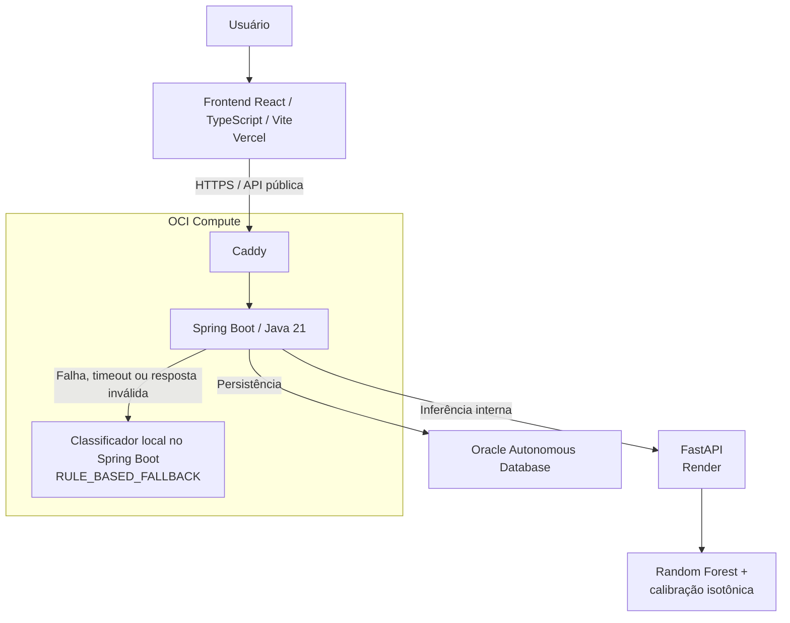

# Arquitetura implantada

## Visão geral

Em termos textuais: o usuário interage com a SPA React/TypeScript/Vite na
Vercel. A SPA chama HTTPS na API pública do Spring Boot. Na OCI Compute, Caddy
é o proxy reverso HTTPS e encaminha ao Spring Boot, que permanece a fronteira
pública. O backend chama a FastAPI no Render para inferência e persiste os
dados da aplicação no Oracle Autonomous Database.

## Responsabilidades

### Frontend

Apresenta autenticação e sessão, formulário, resultado, histórico, detalhe e
dashboard. Configura a API por `VITE_API_BASE_URL`. Não chama `/predict` e não
acessa FastAPI ou Oracle diretamente.

### Spring Boot e Caddy

Caddy expõe HTTPS; a porta do Spring Boot fica restrita ao ambiente da
instância. Spring Boot é a API pública e responde por autenticação e
autorização, validação, cálculo de custo, orquestração, persistência, consulta
por usuário e tratamento de erros. O custo mensal é calculado aqui com a tarifa
de referência do MVP, não pela FastAPI.

### FastAPI e modelo

No fluxo da aplicação, `/predict` é consumido pelo Spring Boot; o frontend não
acessa a FastAPI diretamente. O modelo atual é Random Forest com calibração
isotônica. Uma resposta FastAPI válida é registrada como `ML_MODEL`.

### Oracle Autonomous Database

Armazena dados da aplicação. Flyway gerencia o schema, e cada análise é
vinculada ao usuário autenticado para restringir histórico, detalhe e
dashboard.

## Resiliência

A FastAPI é uma dependência degradável: erro, timeout ou resposta incompatível
não derruba o Spring Boot. Nessa situação, o backend produz localmente a
classificação e as recomendações com `RULE_BASED_FALLBACK`, persiste a análise e
mantém a resposta pública disponível. Esse caminho não é ML e não pretende ser
equivalente ao modelo V2. A FastAPI não participa da readiness do backend.

Os campos e rotas normativos estão em [docs/api-contract.md](../api-contract.md);
este documento não os redefine.
