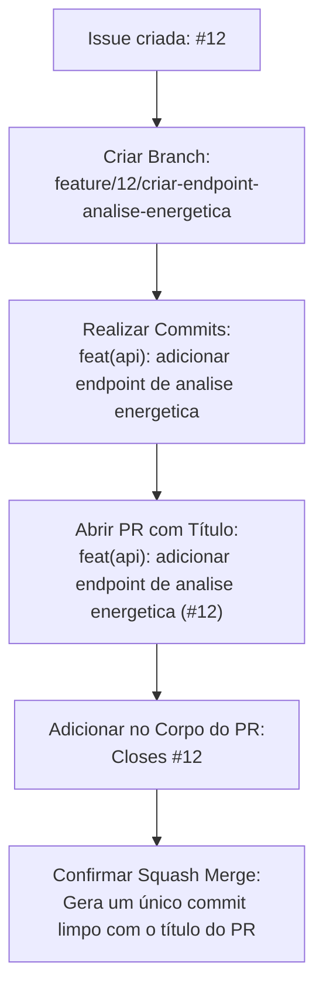

# Pull Requests e Squash Merge

Este documento descreve as diretrizes para a abertura e integração de Pull Requests (PRs) utilizando a estratégia de **Squash Merge** no projeto **EnergiAI**.

---

## Diretrizes Gerais para Pull Requests

Todo Pull Request criado no repositório deve respeitar as seguintes regras:

1. **Branch de Destino**: Deve ser aberto contra a branch `develop`, exceto hotfixes que devem ser abertos contra a `main`.
2. **Título Padronizado**: Siga a especificação de Conventional Commits informando o número da Issue no final (detalhado abaixo).
3. **Escopo Claro**: O corpo do PR deve descrever de forma simples o que foi alterado e o impacto dessas mudanças.
4. **Instruções de Teste**: Inclua orientações passo a passo sobre como validar a sua implementação.
5. **Vinculação de Issues**: Faça a associação da Issue correspondente utilizando palavras-chave de fechamento (ex: `Closes #12`).
6. **Tamanho Controlado**: Evite abrir PRs gigantescos. PRs menores facilitam a revisão de código, evitam gargalos de entrega e diminuem a chance de bugs passarem desapercebidos.
7. **Revisões Obligatórias**: Aguarde a aprovação de pelo menos um revisor do time antes de realizar o merge.

---

## Padrão de Título do PR

O título do Pull Request deve seguir rigorosamente a sintaxe:

```bash
<tipo>(<escopo>): <descricao> (#<numero-da-issue>)
```

### Exemplos de Títulos Corretos

```bash
feat(api): adicionar endpoint de analise energetica (#1)
feat(classification): implementar classificacao por consumo (#2)
fix(validation): corrigir validacao de consumo negativo (#4)
docs(readme): atualizar instrucoes de execucao (#5)
test(service): adicionar testes da classificacao energetica (#6)
refactor(dto): padronizar objetos de entrada e saida (#7)
chore(docker): adicionar dockerfile da api (#8)
```

---

## Template Recomendado para Pull Requests

Ao abrir o PR, copie e preencha o template a seguir no campo de descrição:

```markdown
## O que foi feito

- [Descreva a alteração ou nova funcionalidade de forma objetiva]
- [Adicione detalhes técnicos relevantes, se necessário]

## Como testar

1. Subir a aplicação localmente
2. Executar o comando: [insira comando de teste, ex: npm test / mvn clean test]
3. Enviar uma requisição de teste para o endpoint modificado (ex via Postman ou Swagger)

## Issue relacionada

Closes #[Número da Issue]
```

---

## Integração via Squash Merge

O projeto utiliza a estratégia de **Squash Merge** por padrão para mesclar os Pull Requests. 

### O que é Squash Merge?
É a técnica onde todos os commits intermediários realizados em uma branch de funcionalidade são agrupados e compactados em um **único commit limpo** ao ser integrado na branch principal (`develop` ou `main`).

### Benefícios
* Mantém o histórico do Git limpo e linear.
* Facilita reverter alterações inteiras caso necessário.
* Remove commits de progresso intermediários (como "fix typo", "ajuste" ou "teste") do histórico da branch de destino.

### Regras para o Squash Merge

* **Título do Commit Final**: O título final do commit de squash no GitHub deve seguir o padrão Conventional Commits com o número da Issue no final (idêntico ao título do PR).
* **Corpo do Commit**: O corpo do commit final deve reter o link com a Issue (ex: `Closes #12`) para que o GitHub feche a Issue automaticamente quando o merge ocorrer.
* **Atenção na confirmação**: Antes de clicar em confirmar o merge, sempre revise a caixa de texto do título do commit gerada pelo GitHub. Remova qualquer título de commit intermediário gerado de forma automática que fuja do padrão.

---

## Relação Completa: Branch, PR e Squash Merge

Para garantir o sucesso no processo, acompanhe este exemplo de fluxo completo e integrado:


