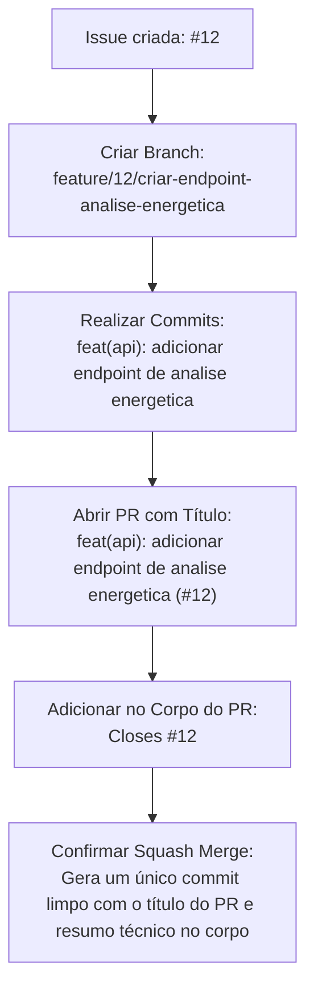

# Pull Requests e Squash Merge

Este documento descreve as diretrizes para a abertura e integração de Pull Requests (PRs) utilizando a estratégia de **Squash Merge** no projeto **EnergiAI**.

---

## Diretrizes Gerais para Pull Requests

Todo Pull Request criado no repositório deve respeitar as seguintes regras:

1. **Branch de Destino**: Deve ser aberto contra a branch `develop`, exceto hotfixes que devem ser abertos contra a `main`.
2. **Título Padronizado**: Siga a especificação de Conventional Commits informando o número da Issue principal no final (detalhado abaixo).
3. **Escopo Claro**: O corpo do PR deve descrever de forma simples o que foi alterado e o impacto dessas mudanças.
4. **Instruções de Teste**: Inclua orientações passo a passo sobre como validar a sua implementação.
5. **Vinculação de Issues**: Faça a associação da Issue correspondente utilizando palavras-chave de fechamento (ex: `Closes #12`).
6. **Tamanho Controlado**: Evite abrir PRs gigantescos. PRs menores facilitam a revisão de código, evitam gargalos de entrega e diminuem a chance de bugs passarem desapercebidos.
7. **Revisões Obrigatórias**: Aguarde a aprovação de pelo menos um revisor do time antes de realizar o merge.
8. **Idioma**: Pull Requests devem ser escritos preferencialmente em português (PT-BR).

---

## Padrão de Título do PR e do Squash Merge

O título do Pull Request e o título final do Squash Merge devem seguir rigorosamente o seguinte formato:

```bash
<tipo>(<escopo>): <descricao> (#<numero-da-issue>)
```

> [!IMPORTANT]
> * **Número da Issue Principal**: O número no final deve ser exclusivamente o número da **Issue principal relacionada**.
> * **Não inclua o número do Pull Request** no título do commit final.
> * **Evitar títulos duplicados** contendo tanto a issue quanto o PR, como:
>   `docs(patterns): adicionar diretrizes e padroes de desenvolvimento (#1) (#6)`
>   (Nesse caso, `#1` é a Issue e `#6` é o Pull Request. O correto é manter apenas o número da Issue: `docs(patterns): adicionar diretrizes e padroes de desenvolvimento (#1)`).

### Exemplos de Títulos Corretos

```bash
docs(patterns): adicionar diretrizes e padroes de desenvolvimento (#1)
feat(api): adicionar endpoint de analise energetica (#12)
fix(validation): corrigir validacao de consumo negativo (#18)
```


---

## Template Recomendado para Pull Requests

Ao abrir o PR, copie e preencha o template a seguir no campo de descrição:

```markdown
## O que foi feito

- [Descreva a alteração ou nova funcionalidade de forma objetiva]
- [Adicione detalhes técnicos relevantes, se necessário]

## Como testar

1. Subir a aplicação localmente
2. Executar o comando: [insira comando de teste, ex: npm test / mvn clean test]
3. Enviar uma requisição de teste para o endpoint modificado (ex via Postman ou Swagger)

## Issue relacionada

Closes #[Número da Issue]
```

---

## Integração via Squash Merge

O projeto utiliza a estratégia de **Squash Merge** por padrão para mesclar os Pull Requests. 

### O que é Squash Merge?
É a técnica onde todos os commits intermediários realizados em uma branch de funcionalidade são agrupados e compactados em um **único commit limpo** ao ser integrado na branch principal (`develop` ou `main`).

### Benefícios
* Mantém o histórico do Git limpo e linear.
* Facilita reverter alterações inteiras caso necessário.
* Remove commits de progresso intermediários (como "fix typo", "ajuste" ou "teste") do histórico da branch de destino.

### Regras para o Squash Merge

* **Título do Commit Final**: O título final do commit de squash no GitHub deve seguir o padrão Conventional Commits com o número da Issue principal no final (idêntico ao título do PR).
* **Corpo do Commit (Extended Description)**: No Squash Merge, o campo *Extended description* do formulário do GitHub vira o corpo do commit final.
  * A descrição **não precisa ser obrigatoriamente a lista automática de commits** gerada pelo GitHub.
  * A recomendação do projeto é usar esse campo para fazer um **resumo técnico** das entregas do PR e manter a referência de fechamento da Issue (`Closes #issue`).
  * Também é aceitável manter a lista de commits na descrição caso eles estejam muito bem escritos e sejam úteis para entender a entrega. Contudo, para manter o histórico do Git limpo, dê preferência ao formato de *resumo técnico + Closes #issue*.

**Exemplo recomendado de preenchimento para a Extended Description:**
```text
- Cria documentacao de fluxo Git
- Define padrao de branches
- Define padrao de commits
- Define padrao de Pull Requests
- Adiciona orientacoes de Squash Merge

Closes #1
```

* **Atenção na confirmação**: Antes de clicar em confirmar o merge, sempre revise a caixa de texto do título e a descrição do commit geradas automaticamente pelo GitHub. Ajuste para o padrão e remova qualquer commit intermediário ou título duplicado desnecessário (ex: manter apenas a referência à Issue, removendo a referência redundante ao PR).

---

## Relação Completa: Branch, PR e Squash Merge

Para garantir o sucesso no processo, acompanhe este exemplo de fluxo completo e integrado:


```
